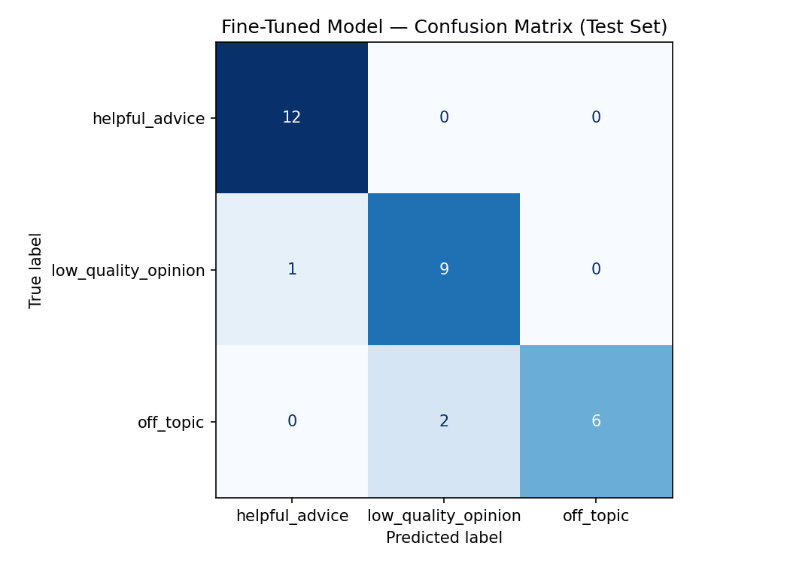

# TakeMeter: CS Career Discussion Quality Classifier

## Overview

TakeMeter is a fine-tuned text classification model that evaluates discourse quality in online Computer Science career communities.

The goal is to classify posts and comments from communities such as r/cscareerquestions, r/csMajors, and r/ITCareerQuestions into one of three categories:

* **helpful_advice** – Actionable and constructive career guidance.
* **low_quality_opinion** – Unsupported pessimistic opinions, doomposting, or overly generalized claims.
* **off_topic** – Content unrelated to CS careers or professional development.

This project explores whether a fine-tuned DistilBERT classifier can learn these distinctions and how its performance compares to a modern zero-shot LLM baseline.

---

# Label Taxonomy

## helpful_advice

Posts that provide specific, actionable, and constructive career guidance.

Examples:

* "Tailor your resume to every application."
* "Practice LeetCode consistently."
* "Build projects related to the jobs you want."

---

## low_quality_opinion

Posts that express unsupported opinions, doomposting, exaggeration, or unproductive negativity.

Examples:

* "CS is dead."
* "Nobody gets hired anymore."
* "Every company is replacing engineers with AI."

---

## off_topic

Posts unrelated to CS careers, internships, software engineering, or professional development.

Examples:

* "What's your favorite movie?"
* "Coffee tastes great today."
* "What music are you listening to lately?"

---

# Dataset

## Community Sources

Data was collected from:

* Reddit r/cscareerquestions
* Reddit r/csMajors
* Reddit r/ITCareerQuestions

Posts and comments were manually labeled according to the taxonomy above.

---

## Dataset Statistics

Total examples: **201**

Label distribution:

| Label               | Count |
| ------------------- | ----: |
| helpful_advice      |    75 |
| low_quality_opinion |    70 |
| off_topic           |    55 |
| Total               |   201 |

---

# Model

Model:

```text
DistilBERT (distilbert-base-uncased)
```

Framework:

```text
Hugging Face Transformers
```

Task:

```text
Multi-class text classification
```

Number of classes:

```text
3
```

---

# Training Configuration

| Hyperparameter   | Value |
| ---------------- | ----- |
| Epochs           | 3     |
| Learning Rate    | 2e-5  |
| Train Batch Size | 16    |
| Eval Batch Size  | 32    |
| Weight Decay     | 0.01  |
| Warmup Steps     | 50    |

---

# Dataset Split

The dataset was split using stratified sampling:

| Split      | Percentage |
| ---------- | ---------: |
| Train      |        70% |
| Validation |        15% |
| Test       |        15% |

Final test set size:

```text
30 examples
```

---

# Fine-Tuned Model Results

## Test Accuracy

```text
0.60
```

### Classification Report

| Label               | Precision | Recall |   F1 |
| ------------------- | --------: | -----: | ---: |
| helpful_advice      |      0.67 |   1.00 | 0.80 |
| low_quality_opinion |      0.50 |   0.60 | 0.55 |
| off_topic           |      0.00 |   0.00 | 0.00 |

Overall Accuracy:

```text
60%
```

---


# Confusion Matrix



Observations:

* The model learned helpful_advice extremely well.
* The model partially learned low_quality_opinion.
* The model struggled to distinguish off_topic examples from low_quality_opinion examples.

---

# Zero-Shot Baseline (Groq)

Model:

```text
Llama-3.3-70B-Versatile
```

Method:

A zero-shot prompt was provided containing label definitions and examples.

### Baseline Accuracy

```text
1.00
```

### Baseline Result

| Metric    | Value |
| --------- | ----: |
| Accuracy  |  1.00 |
| Precision |  1.00 |
| Recall    |  1.00 |
| F1        |  1.00 |

---

# Comparison

| Model                   | Accuracy |
| ----------------------- | -------: |
| Groq Zero-Shot Baseline |     1.00 |
| Fine-Tuned DistilBERT   |     0.60 |

Difference:

```text
-0.40
```

The Groq baseline significantly outperformed the fine-tuned DistilBERT model.

This suggests that the classification task was relatively easy for a modern large language model because the three labels were highly distinguishable. DistilBERT was able to learn meaningful patterns but was limited by the relatively small dataset size.

---

# Failure Analysis

## Failure Example 1

Text:

```text
Coffee tastes great today.
```

True Label:

```text
off_topic
```

Predicted Label:

```text
low_quality_opinion
```

Reason:

The model struggled to recognize casual conversational content and incorrectly grouped it with low-quality discussion.

---

## Failure Example 2

Text:

```text
Companies never hire juniors.
```

True Label:

```text
low_quality_opinion
```

Predicted Label:

```text
helpful_advice
```

Reason:

The model associated employment-related language with career guidance even though the statement was pessimistic and unsupported.

---

## Failure Example 3

Text:

```text
Technical interviews are designed only to reject candidates.
```

True Label:

```text
low_quality_opinion
```

Predicted Label:

```text
helpful_advice
```

Reason:

The model focused on interview-related keywords and failed to recognize the negative sentiment of the statement.

---

# Key Takeaways

* Data quality and label design matter more than model complexity.
* Fine-tuning can learn useful distinctions even with a relatively small dataset.
* Modern LLMs remain extremely strong baselines for straightforward classification tasks.
* Failure analysis reveals weaknesses that are not obvious from accuracy alone.

---

# Repository Structure

```text
takemeter/
│
├── data/
│   └── career_advice.csv
│
├── notebooks/
│   └── TakeMeter_Project3_Shivani.ipynb
│
├── models/
│
├── evaluation/
│   ├── confusion_matrix.png
│   └── evaluation_results.json
│
└── README.md
```

---

# AI Usage Disclosure

ChatGPT was used as a learning assistant to:

* Understand fine-tuning concepts
* Debug notebook issues
* Review evaluation results
* Improve README structure

All dataset collection, labeling decisions, training runs, and final analysis were completed by the author.
